<p align="center">
  
</p>

<h1 align="center">iHBEQuant</h1>
<h3 align="center">Individual Hydrogen Bond Energy Quantifier</h3>

<p align="center">
  <a href="https://www.python.org/"></a>
  <a href="https://gaussian.com/"></a>
  <a href="LICENSE"></a>
  
  
  
</p>

<p align="center">
  <b>Automated individual hydrogen bond energy calculation using the Molecular Tailoring Approach (MTA)</b>
</p>

---

## Table of Contents

- [Overview](#overview)
- [Workflow](#workflow)
- [Theory & Equations](#theory--equations)
- [Features](#features)
- [Requirements](#requirements)
- [Installation](#installation)
- [Quick Start](#quick-start)
- [Configuration](#configuration)
- [Usage](#usage)
- [Output](#output)
- [Example](#example)
- [Limitations](#limitations)
- [Tips for Reliable Results](#tips-for-reliable-results)
- [Citations](#citations)
- [Author](#author)
- [License](#license)

---

## Overview

Hydrogen bonds govern molecular recognition, crystal packing, protein folding, and the physical properties of liquids and solids. Standard quantum chemical calculations return only a *total* interaction energy for a cluster, making it impossible to directly assess the role of each individual hydrogen bond. **iHBEQuant** solves this by implementing the **Molecular Tailoring Approach (MTA)** for automated individual hydrogen bond energy (HBE) quantification. Given a cluster geometry in XYZ format, it:

---

## Workflow

The complete iHBEQuant pipeline — from a single XYZ file to a fully annotated energy summary:

<p align="center">
  
</p>

| Step | Description |
|------|-------------|
| **0 — Read XYZ** | Parse Cartesian coordinates and element symbols |
| **1 — Monomer detection** | Flood-fill on covalent bonds to assign atoms to monomers M1, M2, … |
| **2 — HB detection** | Geometry-driven D–H···A search with configurable distance and angle thresholds |
| **3 — Generate parent `.gjf`** | Full N-monomer cluster single-point input |
| **4 — Generate monomer `.gjf` files** | One isolated monomer input per fragment |
| **5 — Generate primary fragment `.gjf` files** | Cluster-minus-one-monomer inputs |
| **6 — Generate pair files per HB** | Overlap fragment (cluster − D − A) and isolated dimer (D + A) |
| **7 — Run Gaussian 16** | Submit all `.gjf` files; up to `njob` jobs run in parallel |
| **8 — Compute HB energies** | Apply MTA formulae to extract $E_\text{HB}^\text{MTA}$, $E_\text{HB}^\text{Dimer}$, $\Delta E_\text{HB}^\text{Coop}$ |
| **9 — Write summary** | `_summary.txt` with header table, per-HB energy table, raw Hartree energies, and all fragment coordinates |

---

## Theory & Equations

iHBEQuant implements the MTA fragmentation scheme of Ahirwar, Gadre & Deshmukh (2020), extended by Patkar et al. (2021–2022).

### Fragment energies required per HB

For hydrogen bond $n$ between donor monomer $i$ and acceptor monomer $j$ in an $N$-monomer cluster, seven single-point energies are required:

| Symbol | File | Description |
|--------|------|-------------|
| $E_\text{M}$ | `prefix_M.gjf` | Full $N$-monomer parent cluster |
| $E_{\text{frag},i}$ | `prefix_frag_Mi.gjf` | Cluster with monomer $i$ removed |
| $E_{\text{frag},j}$ | `prefix_frag_Mj.gjf` | Cluster with monomer $j$ removed |
| $E_{\text{frag},ij}$ | `prefix_frag_MiMj.gjf` | Cluster with both $i$ and $j$ removed (overlap) |
| $E_{\text{dimer},ij}$ | `prefix_dimer_MiMj.gjf` | Isolated donor–acceptor dimer |
| $E_{\text{mono},i}$ | `prefix_mono_Mi.gjf` | Isolated donor monomer |
| $E_{\text{mono},j}$ | `prefix_mono_Mj.gjf` | Isolated acceptor monomer |

---

### 1. MTA Hydrogen Bond Energy

The individual HB energy of HB $n$ **within the full cluster environment** — denoted $E_\text{HB}^\text{MTA}$:

$$\boxed{
E_\text{HB}^\text{MTA} \;=\;
\Bigl[\bigl(E_{\text{frag},i} + E_{\text{frag},j} - E_{\text{frag},ij}\bigr) - E_\text{M}\Bigr]
\times 627.5095 \quad \text{kcal mol}^{-1}
}$$

The three-fragment inclusion–exclusion reconstructs the D···A pair contribution within the cluster; subtracting $E_\text{M}$ isolates the individual HB.

---

### 2. Dimer Hydrogen Bond Energy

The **pairwise interaction energy of the isolated donor–acceptor dimer** in vacuum — denoted $E_\text{HB}^\text{Dimer}$:

$$\boxed{
E_\text{HB}^\text{Dimer} \;=\;
\Bigl[E_{\text{mono},i} + E_{\text{mono},j} - E_{\text{dimer},ij}\Bigr]
\times 627.5095 \quad \text{kcal mol}^{-1}
}$$

This is the conventional counterpoise-free interaction energy with no influence from remaining monomers.

---

### 3. Cooperativity Energy

The many-body enhancement (cooperative) or weakening (anti-cooperative) due to the surrounding cluster — denoted $\Delta E_\text{HB}^\text{Coop}$:

$$\boxed{
\Delta E_\text{HB}^\text{Coop} \;=\; E_\text{HB}^\text{MTA} \;-\; E_\text{HB}^\text{Dimer}
}$$

| Sign | Interpretation |
|------|---------------|
| $\Delta E_\text{HB}^\text{Coop} > 0$ | Cluster environment **strengthens** the HB (cooperative) |
| $\Delta E_\text{HB}^\text{Coop} < 0$ | Cluster environment **weakens** the HB (anti-cooperative) |
| $\Delta E_\text{HB}^\text{Coop} = 0$ | No environmental influence (purely pairwise) |

---

### 4. Cluster Binding Energy

Total stabilization energy of the $N$-monomer cluster — denoted $E_\text{HB}^\text{BE}$:

$$\boxed{
E_\text{HB}^\text{BE} \;=\;
\left(E_\text{M} - \sum_{k=1}^{N} E_{\text{mono},k}\right)
\times 627.5095 \quad \text{kcal mol}^{-1}
}$$

**Average binding energy per hydrogen bond** ($n_\text{HB}$ = number of detected HBs), denoted $E_\text{HB}^\text{ABE}$:

$$\boxed{
E_\text{HB}^\text{ABE} \;=\; \frac{E_\text{HB}^\text{BE}}{n_\text{HB}}
}$$

---

### 5. MTA Error — Internal Consistency Diagnostic

The MTA error quantifies the deviation between the total binding energy and the sum of individual HBEs — denoted $E_\text{HB}^\text{Err}$:

$$\boxed{
E_\text{HB}^\text{Err} \;=\;
\left|\,\bigl|E_\text{HB}^\text{BE}\bigr| \;-\; \sum_{n=1}^{n_\text{HB}} E_{\text{HB},n}^\text{MTA}\,\right|
}$$

**Per-HB MTA error**, denoted $E_\text{HB}^\text{AErr}$:

$$\boxed{
E_\text{HB}^\text{AErr} \;=\; \frac{E_\text{HB}^\text{Err}}{n_\text{HB}}
}$$


---

### Summary of notation

| Symbol | Meaning |
|--------|---------|
| $E_\text{HB}^\text{MTA}$ | Individual HB energy in the cluster (MTA) |
| $E_\text{HB}^\text{Dimer}$ | Isolated pairwise HB energy |
| $\Delta E_\text{HB}^\text{Coop}$ | Cooperativity energy |
| $E_\text{HB}^\text{BE}$ | Total cluster binding energy |
| $E_\text{HB}^\text{ABE}$ | Average binding energy per HB |
| $E_\text{HB}^\text{Err}$ | Total MTA error |
| $E_\text{HB}^\text{AErr}$ | Per-HB MTA error |

---

## Features

- **Automatic HB detection** — geometry-driven D–H···A search with fully configurable distance and angle thresholds
- **Three run modes** — `gen` (write files only), `run` (submit to Gaussian 16), `cal` (parse existing logs)
- **Three energy components per HB** — $E_\text{HB}^\text{MTA}$, $E_\text{HB}^\text{Dimer}$, $\Delta E_\text{HB}^\text{Coop}$ for every detected hydrogen bond
- **Cluster diagnostics** — $E_\text{HB}^\text{BE}$, $E_\text{HB}^\text{ABE}$, $E_\text{HB}^\text{Err}$, $E_\text{HB}^\text{AErr}$ for self-consistency checks
- **Clear file-naming convention** — all outputs in a per-system subdirectory with structured naming
- **Multi-file batch processing** — space-separated or bracketed `.xyz` list in `INPUT.cfg`
- **Parallel Gaussian jobs** — configurable `njob` for concurrent execution
- **Supports DFT, MP2, CCSD(T)** — any single-point method available in Gaussian 16
- **Zero dependencies** — Python standard library only; no `pip install` required
- **Coordinates embedded in summary** — all fragment geometries and dipole moments written to `_summary.txt`

---

## Requirements

- **Python 3.6+** — standard library only
- **[Gaussian 16](https://gaussian.com/)** — `g16` must be on system `$PATH` (required for `run` and `cal` modes; `gen` mode works without Gaussian)
- `formchk` — optional, for generating `.fchk` checkpoint files

---

## Installation

```bash
git clone https://github.com/deepakpatkar738/iHBEQuant.git
cd iHBEQuant
```

No compilation or package installation needed. Run directly with:

```bash
python iHBEQuant_F.py
```

---

## Quick Start

1. Place your cluster geometry as a standard XYZ file (e.g. `F3N1.xyz`) in the working directory.
2. Edit `INPUT.cfg` — set the XYZ filename, method, basis set, charge, multiplicity, and run mode.
3. Execute:

```bash
python iHBEQuant_F.py -c INPUT.cfg
```

Results appear in a subdirectory named after your XYZ file (e.g. `F3N1/`).

---

## Configuration

All run parameters are controlled through a plain-text `INPUT.cfg` file. Inline `#` comments are stripped automatically.

```ini
[SYSTEM]
xyz_file  = [F3N1.xyz
             F3N2.xyz]       # one or more XYZ files (brackets support multi-line lists)
nproc     = 16               # CPU cores per Gaussian job
mem       = 16GB             # memory per Gaussian job
chk       = N                # Y → generate .fchk for all fragments; N → parent only

[THEORY]
method       = MP2           # DFT functional, MP2, CCSD, CCSD(T), etc.
basis        = aug-cc-pVTZ   # basis set (Gaussian notation)
frq          = N             # Y → add freq keyword to parent calculation
keywords     = scf=tight     # any extra Gaussian route keywords
charge       = 0             # total charge of the cluster
multiplicity = 1             # spin multiplicity

[THRESHOLDS]
covtol_cutoff    = 0.3       # covalent bond tolerance (Å) — see tuning guide
HB_acceptor      = F, O, N, S
HB_donor         = F, O, N, S
neigh_H_cutoff   = 2.5      # pre-screening radius for H···A search (Å)
hb_distance_min  = 1.3      # H···A minimum distance (Å)
hb_distance_max  = 2.3      # H···A maximum distance (Å)
hb_angle_min     = 120.0    # D–H···A minimum angle (degrees)
hb_angle_max     = 180.0    # D–H···A maximum angle (degrees)

[RUN]
mode = run                   # gen | run | cal   (see below)
njob = 2                     # number of parallel Gaussian jobs (mode=run only)
```

> **Important:** `charge` and `multiplicity` apply to the full cluster and are inherited by all fragment calculations. iHBEQuant does **not** auto-detect charges from the XYZ file.

### Run mode reference

| Mode | What it does |
|------|-------------|
| `gen` | Only generates `.gjf` input files — no Gaussian run |
| `run` | Generates `.gjf` files, runs Gaussian (up to `njob` in parallel), then computes energies |
| `cal` | Reads existing `.log` files and computes energies — skips generation and submission |

Use `gen` first to inspect the fragment files, then switch to `run`, or submit jobs manually and use `cal`.

### Tuning `covtol_cutoff`

| Value | When to use |
|-------|-------------|
| 0.2–0.3 Å | Short/strong H-bonds (e.g. NH₃···HF); tight monomer assignment |
| 0.4–0.5 Å | Typical organic molecules |
| 0.6–0.8 Å | Metal–ligand bonds or weakly-bonded systems |

If two molecules incorrectly merge into one monomer → **decrease** `covtol_cutoff`.  
If a real covalent bond is incorrectly broken → **increase** `covtol_cutoff`.

---

## Usage

```bash
python iHBEQuant_F.py                  # use default INPUT.cfg
python iHBEQuant_F.py -c myrun.cfg     # custom config file
python iHBEQuant_F.py -c myrun.cfg -v  # verbose: print energies as computed
```

### Command-line arguments

| Flag | Default | Description |
|------|---------|-------------|
| `-c`, `--config` | `INPUT.cfg` | Path to the configuration file |
| `-v`, `--verbose` | off | Print all generated `.gjf` filenames and energies to screen |

---

## Output

For each input XYZ file (e.g. `F3N1.xyz`), a subdirectory `F3N1/` is created:

```
F3N1/
├── F3N1_M.gjf               ← parent cluster input
├── F3N1_M.log               ← parent cluster output (after run)
├── F3N1_mono_M1.gjf         ← monomer inputs
├── F3N1_mono_M2.gjf
├── F3N1_frag_M1.gjf         ← primary fragment inputs
├── F3N1_frag_M2.gjf
├── HB1_F3N1_frag_M1M4.gjf  ← overlap fragment inputs (per HB)
├── HB1_F3N1_dimer_M1M4.gjf ← dimer inputs (per HB)
├── ...
└── F3N1_summary.txt         ← MAIN RESULT FILE
```

### Summary file sections

**1. Header table** — run metadata, level of theory, geometry thresholds, and cluster-level energetics ($E_\text{HB}^\text{BE}$, $E_\text{HB}^\text{ABE}$, $E_\text{HB}^\text{Err}$, $E_\text{HB}^\text{AErr}$)

**2. HB energy table** — one row per detected HB with D–H···A geometry and all three energies ($E_\text{HB}^\text{MTA}$, $E_\text{HB}^\text{Dimer}$, $\Delta E_\text{HB}^\text{Coop}$)

**3. Calculation details** — raw Hartree energies for every fragment involved in each HB

**4. Coordinates** — Cartesian coordinates and dipole moments (Debye) for every structure

---

## Example — F₃N₁

The repository includes the cyclic **F₃N₁** cluster (3 HF + 1 NH₃, 10 atoms, 4 monomers) as the primary test case.

**Input: `F3N1.xyz`**

```
10
F3N1
F   0.528938   1.580681  -0.060889
H  -0.484242   1.233697   0.014026
F   1.713097  -0.549999  -0.092566
H   0.699939  -0.530521   0.019049
F  -2.194827  -0.990965   0.135048
H  -1.295793  -0.513742  -0.005226
N  -0.038671  -0.062576  -0.009524
H   0.018023   0.028039   1.019697
H   0.862248   0.028748  -0.500004
H  -0.032059  -1.085248  -0.252695
```

**Results at MP2/aug-cc-pVTZ (`scf=tight`):**

```
  Run Time          : 2026-04-16 13:03:05             No. of monomers     : 4
  File              : F3N1.xyz                        No. of HB           : 4
  Mode              : run                             Binding energy      : 50.593
  Level of Theory   : MP2/aug-cc-pVTZ  scf=tight      Avg per HB          : 12.648
  covtol_cutoff     : 0.3                             MTA_HBEs Sum        : 63.380
  HB_acceptor       : F, N, O, S                      Avg per MTA_HB      : 15.845
  HB_donor          : C, CL, F, N, O, S               Total MTA error     : 12.787
  neigh_H_cutoff    : 2.5                             Per-HB error        : 3.197
  hb_distance       : 1.3 - 2.3                       # All energies in kcal/mol:
  hb_angle          : 120.0 - 180.0

HB Type             Donor                Acceptor             r(D-H)  r(H...A)  r(D...A)  a(D-H...A)  HB_MTA   HB_Dimer  HB_Coop
HB1 [F1-H2...N7]    M1 [F1 H2]           M4 [N7 H8 H9 H10]   1.074   1.372     2.443     174.12      30.583   19.601    10.982
HB2 [F3-H4...F1]    M2 [F3 H4]           M1 [F1 H2]           0.975   1.472     2.438     169.85      15.937    4.160    11.777
HB3 [F5-H6...F3]    M3 [F5 H6]           M2 [F3 H4]           0.952   1.597     2.537     168.27      10.176    4.443     5.733
HB4 [N7-H8...F5]    M4 [N7 H8 H9 H10]    M3 [F5 H6]           1.026   1.973     2.916     151.54       6.684    1.747     4.937
```

| HB | Type | $E_\text{HB}^\text{MTA}$ | $E_\text{HB}^\text{Dimer}$ | $\Delta E_\text{HB}^\text{Coop}$ |
|----|------|:---:|:---:|:---:|
| HB1 | F–H···N | 30.58 | 19.60 | +10.98 |
| HB2 | F–H···F | 15.94 | 4.16 | +11.78 |
| HB3 | F–H···F | 10.18 | 4.44 | +5.73 |
| HB4 | N–H···F | 6.68 | 1.75 | +4.94 |

*All energies in kcal mol⁻¹.*

All four HBs show **positive cooperativity**, confirming the cyclic cooperative character of the F₃N₁ cluster. The strongest cooperative enhancement is at HB2 (+11.8 kcal mol⁻¹), where the HF monomer acts simultaneously as donor and acceptor in the hydrogen-bond chain. The per-HB MTA error of 3.2 kcal mol⁻¹ is consistent with many-body effects beyond the pairwise level at this basis set.

---

## Limitations

- **Covalent radii** are hard-coded for H, C, N, O, F, S, P, Cl, Si. For other elements, extend the `COV_R` dictionary in the script.
- **Charge and multiplicity** set in `[THEORY]` are applied uniformly to all fragments. For charged or open-shell clusters, set these carefully — iHBEQuant does not attempt to assign partial charges to individual fragments.
- **MTA additivity error** arises from many-body terms beyond the pairwise level. Strong cooperativity or compact cyclic geometries typically give larger $E_\text{HB}^\text{AErr}$. Values below ~3–4 kcal mol⁻¹ indicate reliable decomposition.
- **Gaussian 16 only** — the script calls `g16`. To use Gaussian 09, change the `G16` variable at the top of the script.

---

## Tips for Reliable Results

**Monomer splitting issues** — if monomers merge incorrectly, reduce `covtol_cutoff`. Print all pairwise interatomic distances to diagnose.

**Missing HBs** — increase `hb_distance_max` (e.g. to 2.5 Å for weak HBs) or decrease `hb_angle_min` (e.g. to 100°). Keep `neigh_H_cutoff` slightly larger than `hb_distance_max`.

**Parallel execution** — do not set `njob` larger than the available compute nodes; each job uses `nproc` cores and `mem` memory as specified.

**Checkpoint files** — setting `chk=Y` generates formatted `.fchk` files for all fragments, usable in GaussView, NBO, or AIM analyses.

---

## Citations

If you use iHBEQuant in published work, please cite all three papers:

1. Patkar D; Ahirwar MB; Deshmukh MM *ChemPhysChem* **2022**, *23*, e202200476.
2. Patkar D; Ahirwar MB; Deshmukh MM *ChemPhysChem* **2022**, *23*, e202200143.
3. Patkar D; Ahirwar MB; Deshmukh MM *New J. Chem.* **2022**, *46*, 2368–2379.

---

## Author

**Deepak Patkar**

For questions, bug reports, or feature suggestions, please open a [GitHub Issue](../../issues) or submit a pull request.

---

## License

This project is distributed under the [MIT License](LICENSE).
